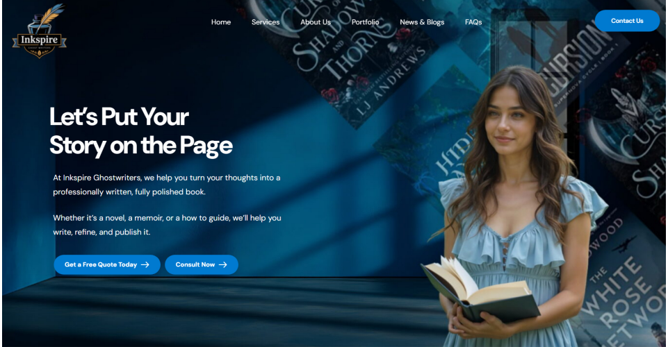

# Inkspire Ghostwriters – Case Study
A content-driven corporate website for Inkspire Ghostwriters to showcase services and generate leads.

## 📌 Project Overview
The aim was to build a modern, responsive site with persuasive landing pages, service details, and integrated lead capture.

## 🛠 Tech Stack
- **WordPress**
- Elementor Pro
- LiteSpeed Cache
- Contact Form Integration
  
## 💼 My Role
- Layout and section design for services
- Lead-focused call-to-action placement
- Mobile optimization
- On-page SEO setup

## 🚀 Key Results
- Increased inquiry submissions with above-the-fold forms
- Improved service page clarity and structure
  
## ⚡ Challenges & Solutions
**Challenge:** Low conversion rates from homepage.  

**Solution:** Reworked hero and CTA structure to direct users quickly to contact forms.

## 🔗 Live Project

[Visit Inkspire Ghostwriters](https://inkspireghostwriters.com/)

## 📷 Screenshots

📸 View Screens

**Homepage**  
  
**Service Section**  
  
**Contact Form**  

